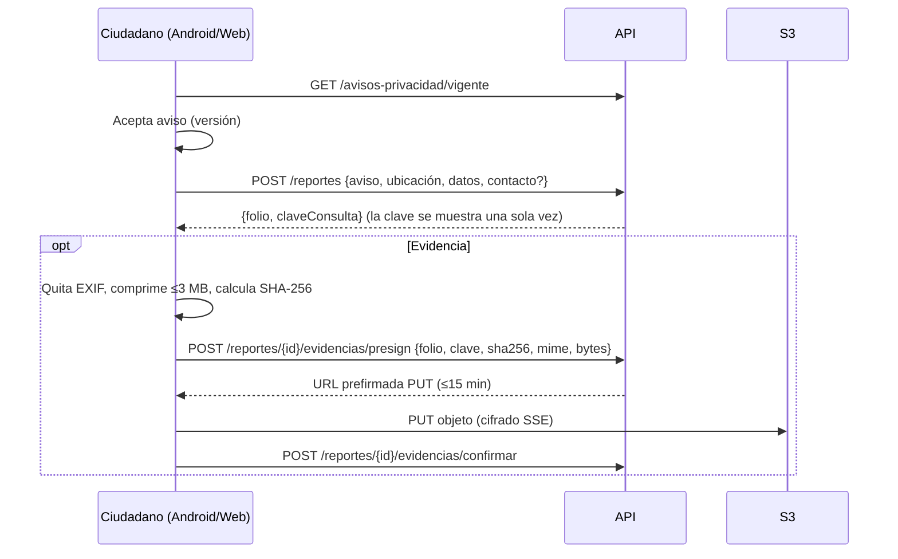

# RIETI — Plan de despliegue y desarrollo hasta la presentación

> **Para quién es este documento:** la sesión de desarrollo conectada al proyecto SIPINNA/RIETI (Android + backend + web + infraestructura).
> **Fecha de redacción:** 9-oct-2026. **Presentación con el socio formador:** en 1–2 semanas (fecha exacta por confirmar).
> **Dueño del documento:** Braulio "Bowser" Barbosa (rol Etapa 3 #1, App Android).
> **Fuentes:** Etapa 1 (Requerimientos, 26-ago-2026), Etapa 2 (Diseño, 11-sep-2026), estado del repo/AWS reportado el 9-oct-2026 y las decisiones del equipo de la sección 2.

---

## 0. Cómo arrancar la sesión

1. Lee `CLAUDE.md` (raíz del repo) y este plan completo.
2. **Fase 0 primero** (sección 8): audita el estado real del repo y de AWS. Varias cosas de este plan están marcadas **[VERIFICAR]** porque quien redactó el plan no vio el código desplegado, solo lo que reportó la sesión que lo desplegó.
3. Trabaja por fases, en ramas cortas y con PR. No hagas `terraform apply`, `terraform destroy` ni comandos de escritura de AWS sin aprobación explícita del usuario.
4. Al terminar cada fase, actualiza la sección 12 (estado) de este archivo.

**Prompt sugerido para iniciar:**
> Lee `CLAUDE.md` y `docs/PLAN-RIETI.md`. Empieza por la Fase 0 (auditoría del estado real). Dame un resumen de lo que encuentres contra lo que dice el plan, marca las discrepancias y proponme el orden de la Fase 1 antes de escribir código.

---

## 1. Estado actual

### 1.1 Repositorio
- `https://github.com/A01752370/RIETI` — monorepo: app Android en la raíz, `backend/` (NestJS), `infra/terraform/`, `.github/`.
- Rama `main`: infraestructura y backend desplegados por otra sesión. Rama `android-integracion`: app Android que **compila** contra el repo actual (ya con push).
- **El repo debe ser público para la entrega** (rúbrica Etapa 3). Antes de hacerlo público, ver sección 10.4 (higiene de secretos).

### 1.2 Android (verificado hoy)
| Tema | Estado |
|---|---|
| Build | Compila. AGP 8.13.2, Gradle 8.13, Kotlin 1.9.24, Compose BOM 2024.06.00, compiler extension 1.5.14, minSdk 26, compileSdk/targetSdk 34, `android.useAndroidX=true`. |
| Stack | Jetpack Compose + Material 3, MVVM (`ViewModel` + `StateFlow`), Navigation Compose, Retrofit + Gson + OkHttp logging, Coil, Play Services Location. |
| API | `BuildConfig.API_URL` = `https://d3hexe1fo0mq6l.cloudfront.net/` (sobrescribible con `-Prieti.apiUrl=...`). Debug permite HTTP a `10.0.2.2` por `src/debug/AndroidManifest.xml`; release no permite texto claro. |
| Pantallas | Login (correo/contraseña), Registro (**sin endpoint**), Home, Formulario de reporte (chips + GPS + miniatura de mapa con Coil), Confirmación, Lista de reportes, Seguimiento. |
| Pendiente de verificar | **La app aún no se ha corrido en emulador ni probado contra AWS.** |
| Capas | No hay capa de repositorio ni `UiState` sellado; los ViewModels llaman directo a `ServicioRemoto`. |

### 1.3 Backend / AWS (reportado por la sesión de despliegue; **[VERIFICAR]** todo contra el código y la consola)
- CloudFront (dominio `*.cloudfront.net`, sin Route 53 ni ACM) → ALB → ECS Fargate (NestJS) → RDS PostgreSQL (una AZ, backups de 1 día). WAF en el perímetro. NAT único. Bucket S3 de evidencias (con permisos, **sin endpoint de subida**). Cognito integrado.
- Folio con 6 dígitos (`RIETI-2026-000001`). Existe un reporte de prueba `RIETI-2026-000001` que hay que borrar antes de la demo (la bitácora es solo de inserción; el borrado requiere desactivar el trigger como administrador).
- **No hay usuarios del personal** (el de prueba se borró). El alta documentada es `admin-set-user-password --permanent` (ver `backend/README.md`).
- La API usa el **usuario maestro** de la base de datos. No hay Row Level Security.
- Cuenta AWS en plan gratuito (crédito limitado que vence el 19-dic-2026). Infra ≈90–110 USD/mes.

### 1.4 Lo que **no** se ha visto
- El código del backend desplegado (la sesión que lo escribió sí lo vio; quien redactó este plan no).
- Si `GET /reportes`, `PATCH /reportes/:id` y `GET /reportes/folio/:folio` exigen autenticación hoy.
- Si TypeORM corre con `synchronize: true` en producción.
- Si el ALB acepta tráfico directo de internet o solo de CloudFront.
- Si la Hosted UI de Cognito está disponible/configurada en `mx-central-1`.

---

## 2. Decisiones del equipo (9-oct-2026) y decisiones abiertas

### 2.1 Decisiones tomadas (no reabrir sin avisar)
| ID | Decisión |
|---|---|
| D-01 | El plan gratuito de AWS es suficiente: la presentación es en 1–2 semanas; después el socio decide si se mejora el plan. No hay tema de tiempo/crédito por ahora. |
| D-02 | Backups de RDS de 1 día aceptados para esta etapa. Documentar como limitación (RNF-13 pide 30 días). |
| D-03 | Sin dominio propio: se usa `*.cloudfront.net`. Con que haya funcionalidad es suficiente. |
| D-04 | Sin alta disponibilidad (un NAT, RDS en una AZ, 1 tarea mínima): **decisión de costo**, documentada. |
| D-07 | El primer usuario administrador de Cognito lo crea quien administra la cuenta de AWS; después los usuarios se crean desde la plataforma (ver D-06). |
| D-09 | Alcance en AWS: solo recursos de este proyecto (etiqueta `Project=RIETI` y prefijo `rieti`, región `mx-central-1`). No se opera sobre ningún otro recurso de la cuenta. *Corregido el 9-oct-2026: la versión anterior decía `proyecto=rieti`, que ningún recurso tiene (ver `docs/AUDITORIA-CUENTA.md`).* |
| D-10 | Las credenciales (llave AWS del perfil `rieti` y token de GitHub) se rotan al terminar la sesión de desarrollo. Tras rotar, usar OIDC de GitHub→AWS (sin llaves estáticas). |

### 2.2 Decisiones abiertas — con recomendación (confirmar con el equipo)
| ID | Tema | Recomendación | Por qué |
|---|---|---|---|
| D-05 | A quién llegan las alertas/presupuesto (`alerta_emails`) | Al **responsable de la cuenta AWS + Bowser + compañero de backend**. No al socio formador por ahora. | Las alertas son operativas (costo, caída, errores). Cada destinatario debe confirmar la suscripción SNS desde su correo. Al socio se le puede dar luego un resumen, no las alarmas técnicas. |
| D-06 | Modelo de alta de personal | **Cognito + grupos + tabla `usuario` en BD**; el administrador crea usuarios desde la plataforma (`POST /usuarios` → `AdminCreateUser`). `admin-set-user-password --permanent` queda **solo para el primer administrador** (bootstrap). Login en Android por **Hosted UI (OIDC + PKCE)**. | Cumple RNF-18 (OAuth2/OIDC + 2º factor obligatorio) y RF-33/34/43 sin implementar a mano los desafíos `NEW_PASSWORD_REQUIRED`, MFA y recuperación de contraseña. Ver 5.1. Fallback si la Hosted UI no está disponible en la región: pantalla propia + backend proxy que maneje los desafíos. |
| D-08 | Usuario de base de datos | Crear `rieti_migrator` (dueño del esquema, migraciones) y `rieti_app` (solo `SELECT/INSERT/UPDATE` necesarios, **sin `BYPASSRLS`**, sin DDL). La API usa `rieti_app`. | Con el usuario maestro/dueño las políticas RLS pueden no aplicarse y cualquier inyección SQL tendría permisos totales. **Sí afecta la seguridad y hoy no está cubierto.** No tiene relación con el plan gratuito de AWS. |
| D-11 | Catálogo de estatus | **Etapa 1 es canónica:** Recibido → En revisión → En atención → Canalizado → Concluido / Descartado (con la tabla de transiciones válidas). Actualizar Figma/UI con esos nombres. | Es el documento formal con transiciones y motivo de descarte. Figma usa Registrado/En seguimiento/Archivado. |
| D-12 | Cuentas de ciudadano | **Fuera del MVP.** Ciudadano = reporte anónimo o con medio de contacto; consulta con **folio + clave de consulta** (RF-38, RF-47). Quitar "Crear cuenta" de la app. | Etapa 1 (CU-01) dice que no se requiere cuenta. Figma muestra "Crear cuenta / Mis reportes", lo que contradice la Etapa 1. **Requiere confirmación con el socio formador.** |
| D-13 | Hosting de la web | Misma distribución CloudFront: comportamiento por defecto → S3 (SPA React), `/api/*` → ALB. Prefijo global `/api/v1` en el backend. En Android basta cambiar `API_URL`. | Un solo origen, sin CORS complejo, cookies `SameSite=Strict` posibles. |
| D-14 | Resolución de municipio (RF-12) | MVP: el ciudadano/personal elige del catálogo de municipios (flujo E3 de CU-01). Stretch: resolver por coordenadas con polígonos INEGI en PostGIS. | Los polígonos del Marco Geoestadístico son trabajo extra; el catálogo cubre la demo. |
| D-15 | Folio | Mantener `RIETI-AAAA-NNNNNN` (legible, como Figma) **más** clave de consulta aleatoria obligatoria (hash Argon2id). La consulta exige ambos. | Un folio secuencial solo es enumerable; con la clave deja de ser explotable. |

### 2.3 Recomendaciones del socio formador (registradas el 9-oct-2026)
| ID | Decisión | Estado |
|---|---|---|
| D-16 | Catálogo desplegable con los **125 municipios del Estado de México** (claves INEGI 15001–15125) para que la persona seleccione dónde se genera el reporte. | Implementado en API y web (campo con búsqueda). En el API el municipio es **opcional** hasta que la app Android que lo envía esté publicada y probada; después será obligatorio. |
| D-17 | El municipio o la institución debe proporcionar **correos o enlaces de contacto** de los municipios integrantes de la red. | Estructura implementada (sección "Red de municipios", editable por el administrador). Hoy solo hay **datos de ejemplo** (`example.org`, `es_ejemplo = true`) con aviso visible; los oficiales los entrega la institución y se cargan como datos. |
| D-18 | Es indispensable **mantener el aviso de privacidad** y establecer claramente las **funciones y permisos de cada perfil**. | Aviso obligatorio antes de reportar, con versión, accesible desde el pie y la app. Matriz en `docs/seguridad/roles-y-permisos.md` (implementado vs. planeado), aplicada en el código y verificada con pruebas. |

---

## 3. Alcance del MVP (MoSCoW)

Mapeo a requisitos de Etapa 1. **Must = necesario para la demo y para la rúbrica.**

### Must
| # | Entregable | Requisitos |
|---|---|---|
| M1 | Autenticación del personal con Cognito (JWT validado en backend, roles por grupo, MFA TOTP) + login en Android y web | RF-42, RNF-18 |
| M2 | Registro de reporte anónimo y con contacto, extremo a extremo (Android y web), con folio + clave de consulta | RF-01–06, RF-10, RF-11, RF-47, CU-01, CU-04 |
| M3 | Aviso de privacidad con registro de aceptación (versión + fecha) | RF-44, RNF-26, CU-02 |
| M4 | Consulta pública por folio + clave, con límite de intentos | RF-38, RF-47, RNF-08 |
| M5 | Bandeja del personal: lista, filtros, detalle, cambio de estatus **con máquina de estados**, seguimientos | RF-16–19, RF-23, RF-28 |
| M6 | Evidencias: URL prefirmada ≤15 min, quitar EXIF y comprimir ≤3 MB en el cliente, SHA-256, cifrado en S3 | RF-08, RF-37, RNF-05, RNF-22, RNF-32 |
| M7 | Segmentación territorial con RLS, usuario BD limitado, bitácora de auditoría | RF-35, RF-36, RNF-19, RNF-21 |
| M8 | Privacidad por diseño: sin nombre/CURP/domicilio del menor, ubicación del dispositivo no se persiste, anónimo sin IP/ID de dispositivo en la app | RNF-27, RNF-28, RNF-29 |
| M9 | Perímetro: WAF con límite de tasa, cabeceras de seguridad (HSTS, CSP), ALB solo accesible desde CloudFront, límite de envíos por dispositivo | RNF-16 (parcial), RNF-23 |
| M10 | Contrato OpenAPI 3 versionado (`/api/v1`) | RNF-06 |
| M11 | Documentación de Etapa 3 completa (sección 11) | Rúbrica |
| M12 | CI (build + pruebas + escaneo de secretos) y repo público sin secretos | Rúbrica |

### Should
- Canalización + institución + constancia (RF-15, RF-20, RF-48, CU-10).
- Detección de duplicados: ≤200 m, misma actividad, <72 h (RF-21, flujo A6).
- Peligro inmediato: prioridad alta + 911/089 visibles (RF-07, RNF-37). Recomendaciones de seguridad antes de adjuntar (RF-09).
- Panel web: estadísticas, gráficas, filtros (RF-25, RF-26, RF-28) y mapa de calor (RF-27, RNF-10).
- Administración de usuarios y roles desde la plataforma (RF-33, RF-34).
- Cola offline en Android (Room cifrado + WorkManager) (RF-45, RNF-03).
- Cierre de sesión por inactividad (RF-49).

### Could
Notificaciones por correo (SES en sandbox, RF-46), exportación (RF-41), reincidentes (RF-22), zonas recurrentes y alertas territoriales (RF-30, RF-31), alta de municipio por configuración (RNF-38), pasada de accesibilidad WCAG AA (RNF-35).

### Won't (se documenta como alcance futuro)
WhatsApp (RF-39, fase futura), integración en línea con Procuraduría (RNF-41: solo contrato publicado), Redshift/QuickSight/OpenSearch del diagrama de Etapa 2, Multi-AZ, Route 53/ACM.

> **Si la presentación es en 1 semana:** hacer solo Must (M1–M10 con M11 en paralelo). Si es en 2 semanas: Must + Should en el orden listado.

---

## 4. Desviaciones entre el diseño (Etapa 2) y lo desplegado

Documentarlas con justificación en `docs/arquitectura/aws.md` (es una evaluación honesta, no un error).

| Diseño Etapa 1/2 | Realidad actual | Justificación / mitigación |
|---|---|---|
| Región `mx-central-1`, ≥2 AZ, BD con conmutación automática (RNF-12, §2.5) | Una AZ, un NAT, 1 tarea | D-04: costo. Mitigación: IaC en Terraform permite recrear/ampliar con una variable. |
| Backups diarios, retención 30 días (RNF-13) | 1 día | D-02: límite del plan gratuito. Pasar `db_backup_dias` a 30 con plan de pago. |
| API Gateway + WAF + CloudFront + Route 53 | CloudFront + WAF + ALB; sin Route 53 | D-03. |
| TLS 1.3 sin degradación bajo TLS 1.2 (RNF-16) | Con el certificado por defecto de CloudFront la política mínima de TLS no se puede endurecer (**[VERIFICAR]**; hasta donde se sabe, queda en TLS 1.0+) | Requiere dominio propio + ACM. Documentar como brecha y como razón para adquirir dominio si el socio continúa. HSTS sí se puede aplicar con una *response headers policy*. |
| 2FA obligatorio (RNF-18) | Cognito integrado, MFA **[VERIFICAR]** | Activar MFA TOTP obligatorio (D-06). |
| RLS por municipio (RNF-19) | No existe | M7. |
| Bitácora inmutable con pgAudit (RNF-21) | Tabla de bitácora solo-inserción con trigger (reportado) | pgAudit requiere parámetro `shared_preload_libraries` en un *parameter group* propio y reinicio; es opcional si la tabla de bitácora cubre acceso, consulta y cambio de estatus con IP, usuario y hora. |
| URLs prefirmadas ≤15 min (RNF-22) | Bucket y permisos listos, sin endpoint | M6. |
| Anónimo sin IP (RNF-29) | CloudFront/WAF/ALB registran IP en sus logs | Desactivar o acortar retención de logs de acceso del endpoint de reportes y documentarlo; la app/BD no guardan IP. |
| Límite 5 reportes/h por dispositivo (RNF-23) sin identificador de dispositivo (RNF-29) | — | Conflicto de requisitos. Solución: contador en memoria con **hash salado de la IP** y TTL de 1 h (no se persiste) + regla *rate-based* gruesa en WAF. Documentar la tensión. |
| Redshift + QuickSight + OpenSearch + SES + Lambda | No desplegados | Won't. Las estadísticas salen de PostgreSQL/PostGIS directamente. |
| Docker/Kubernetes (§5.1) | ECS Fargate | Equivalente contenedorizado y gestionado. |

---

## 5. Arquitectura objetivo

### 5.1 Autenticación del personal (D-06)

```mermaid
sequenceDiagram
    autonumber
    participant App as App Android / Web React
    participant HUI as Cognito Hosted UI
    participant API as API NestJS (ECS)
    participant DB as PostgreSQL (RLS)

    App->>HUI: Authorization Code + PKCE (Custom Tab / redirect)
    HUI->>HUI: Contraseña, cambio inicial, TOTP (2FA), recuperación
    HUI-->>App: code → tokens (ID, access, refresh)
    App->>API: Authorization: Bearer <access token>
    API->>API: Valida firma (JWKS), iss, aud/client_id, exp, token_use
    API->>DB: Busca usuario por cognito_sub → rol, municipio
    API->>DB: BEGIN; SET LOCAL app.rol, app.municipio_id
    DB-->>API: Filas filtradas por RLS
    API-->>App: JSON
```

- Grupos de Cognito = rol grueso: `enlace_municipal`, `coordinador`, `administrador`.
- **El municipio del usuario y su estado (activo/inactivo) viven en la tabla `usuario`** (clave `cognito_sub`), no en el token, para que un cambio surta efecto de inmediato.
- Android: `net.openid:appauth`, redirect `mx.sipinna.rieti://auth/callback`, cliente público sin secreto. Tokens en almacenamiento cifrado (Keystore). Cliente de Retrofit con `Authenticator` que renueva con el *refresh token*.
- Web: mismo flujo; tokens preferentemente en cookie `HttpOnly; Secure; SameSite=Strict` mediante un endpoint de intercambio del backend (BFF ligero), tal como pide el diseño (§2.6).
- Primer administrador: creado con la CLI por quien administra la cuenta de AWS (`admin-create-user` / `admin-set-user-password --permanent`), agregado al grupo `administrador` y con fila en `usuario`. **No compartir la contraseña por chat del equipo.**
- Creación posterior: `POST /api/v1/usuarios` (solo administrador) → `AdminCreateUser` + `AdminAddUserToGroup` + inserción en `usuario`; el usuario recibe invitación, cambia contraseña y configura TOTP en el primer acceso.

### 5.2 Ruteo CloudFront (D-13)

```
https://<dist>.cloudfront.net/            → S3 (SPA React, OAC)
https://<dist>.cloudfront.net/api/*       → ALB → ECS (NestJS, prefijo /api/v1)
```
ALB: grupo de seguridad solo desde el *prefix list* gestionado de CloudFront **y** regla de listener que exige una cabecera secreta inyectada por CloudFront (`X-Origin-Verify`). **[VERIFICAR si ya está]**: de lo contrario el ALB es alcanzable directamente y se salta el WAF.

### 5.3 Flujo de reporte ciudadano



---

## 6. Contrato API v1 (objetivo)

Base: `/api/v1`. JSON. Errores con formato único `{ "codigo": "...", "mensaje": "...", "detalle"?: [...] }`. Documentado con `@nestjs/swagger` → `docs/api/openapi.json`.

### Públicos (sin sesión)
| Método | Ruta | Notas |
|---|---|---|
| GET | `/avisos-privacidad/vigente` | Texto + versión. |
| GET | `/catalogos/{actividades\|riesgos\|rangos-edad\|municipios}` | Para llenar chips y selectores (RNF-36). |
| POST | `/reportes` | Rate limit. Devuelve `folio` y `claveConsulta`. |
| POST | `/reportes/consulta` | Body `{folio, clave}`. **POST y no GET** para no dejar la clave en URLs/logs. Devuelve estatus y línea de tiempo pública, sin datos sensibles (RF-38). |
| POST | `/reportes/{id}/evidencias/presign` y `/confirmar` | Autoriza con folio + clave y ventana de 15 min tras crear el reporte. |
| GET | `/health` | Sin datos sensibles. |

### Personal (JWT + rol; RLS por municipio)
| Método | Ruta | Rol |
|---|---|---|
| GET | `/reportes` (filtros: municipio, colonia, desde, hasta, edad, actividad, riesgo, estatus; paginación) | enlace, coordinador, admin(solo lectura agregada) |
| GET | `/reportes/{id}` | enlace, coordinador |
| PATCH | `/reportes/{id}/estatus` `{estatus, comentario, motivo?}` | enlace. Valida la tabla de transiciones; `Descartado` exige motivo. |
| POST | `/reportes/{id}/seguimientos` | enlace |
| POST | `/reportes/{id}/canalizacion` → constancia | enlace |
| GET | `/reportes/{id}/evidencias` → URLs GET prefirmadas ≤15 min | enlace, coordinador |
| GET | `/estadisticas/{resumen\|por-estatus\|por-mes\|mapa-calor}` | enlace (su municipio), coordinador (agregado) |

### Administración
| Método | Ruta |
|---|---|
| GET/POST/PATCH | `/usuarios` (crear = `AdminCreateUser`; desactivar = `AdminDisableUser` + `activo=false`) |
| PUT | `/usuarios/{id}/rol` |
| GET/POST/PATCH | `/municipios` |
| GET | `/bitacora` |

> **Transición de compatibilidad:** la app actual usa `/reportes`, `/reportes/folio/:folio`, `PATCH /reportes/:id`, `/auth/login`. Migrar Android al contrato v1 en la Fase 1 y retirar `/auth/login`.

### Tabla de transiciones de estatus (Etapa 1, §3.1)
| Desde | Hacia |
|---|---|
| Recibido | En revisión, Descartado |
| En revisión | En atención, Canalizado, Descartado |
| En atención | Canalizado, Concluido |
| Canalizado | Concluido |
| Concluido | En atención (solo por reincidencia) |
| Descartado | — (terminal; motivo obligatorio) |

---

## 7. Modelo de datos: cambios sobre el ER de Etapa 2

El ER ya incluye `Ubicacion.latitud/longitud`, `Folio`, `Caso`, `Reporte_Caso`, `Seguimiento`, `Rol Usuario`. Faltan:

| Cambio | Para qué |
|---|---|
| `Municipio` con `clave_inegi` (ya sembrado) y `activo` | RF-12, RNF-38, RNF-40 |
| `Reporte.cantidad_ninos` (o rango) | RF-05 (ya agregado en el backend; **falta en el ER**) |
| `Reporte.clave_consulta_hash` (Argon2id), `Reporte.es_anonimo`, `Reporte.peligro_inmediato`, `Reporte.prioridad` | RF-07, RF-47, CU-04 |
| `Reporte.contacto_cifrado` (cifrado de aplicación, tabla/columna separada de la evidencia) | RF-03, RNF-29 |
| `Reporte.motivo_descarte` | Estatus Descartado |
| `AceptacionAviso(version, fecha)` — **sin** identificadores del dispositivo | RF-44, RNF-26 |
| `Evidencia(id_reporte, s3_key, sha256, mime, bytes, fecha)` | RF-08, RNF-32 |
| `Canalizacion(id_caso, institucion, fecha, responsable, constancia)` | RF-15, RF-20, RF-48 |
| `Bitacora(usuario, accion, entidad, ip, fecha)` — solo inserción | RF-35, RNF-21 |
| `Usuario.cognito_sub`, `Usuario.id_municipio`, `Usuario.activo` | D-06, RNF-19 |
| Eliminar `Usuario.password_hash` para personal (la contraseña vive en Cognito) | RNF-20 |
| Índice GIST sobre la geometría de `Ubicacion` (columna `geography(Point,4326)` derivada de lat/lng) | RF-21, RF-27, RF-30 |

Reglas: **migraciones TypeORM versionadas** (`synchronize: false` fuera de desarrollo), seed idempotente de catálogos, políticas RLS con `FORCE ROW LEVEL SECURITY` en `reporte`, `caso`, `seguimiento`, `evidencia`.

**Inconsistencias de documentación abiertas** (resolver y reflejar en Etapa 2/3): (1) ER sin cantidad de niños; (2) clase `ModalidadReporte` en el diagrama de clases vs campo `tipo_reporte` en el ER; (3) nombres de estatus Etapa 1 vs Figma (D-11); (4) Figma con cuentas de ciudadano vs Etapa 1 sin cuentas (D-12); (5) Etapa 1 pide folio sin secuencias predecibles pero Figma muestra `RIETI-2026-0341` (D-15); (6) el chip "Mendicidad forzada" aparece duplicado en el Figma móvil.

---

## 8. Plan por fases

Estimación en días de trabajo efectivo. Cada fase termina con un demo corto y criterios de aceptación verificables.

### Fase 0 — Auditoría e higiene (0.5–1 día)
- [ ] Clonar, leer `backend/README.md`, `infra/terraform/*`, `.github/`. Listar endpoints reales, guards, esquema y variables.
- [ ] Verificar los **[VERIFICAR]** de la sección 1.4 y reportar cada uno como OK/brecha.
- [ ] Higiene del repo: `.idea/`, `local.properties`, `*.tfstate*`, `*.tfvars`, `.env*`, `build/`, `node_modules/` en `.gitignore`; `git rm -r --cached .idea`.
- [ ] Activar *push protection* y *secret scanning* de GitHub; agregar `gitleaks` en CI y pre-commit.
- [ ] Revisar el historial de git en busca de secretos (`gitleaks detect --log-opts="--all"`) **antes** de hacer público el repo.
- [ ] Protección de `main` (PR obligatorio, CI verde). Convención de ramas `feat/*`, `fix/*`, `docs/*`.
- [ ] Crear issues/milestones a partir de las secciones 3 y 9.
- **Aceptación:** informe de auditoría en `docs/auditoria-inicial.md`; repo sin secretos; CI mínimo corriendo.

### Fase 1 — Seguridad base y contrato (2–3 días)
Backend / infra:
- [ ] Prefijo global `/api/v1`, `ValidationPipe({whitelist, forbidNonWhitelisted, transform})`, `helmet`, Swagger.
- [ ] Cognito: pool con MFA TOTP obligatorio, dominio de Hosted UI, *app client* público con PKCE y callback `mx.sipinna.rieti://auth/callback`, grupos, atributos. En Terraform.
- [ ] Guard JWT (JWKS, `iss`, `client_id`, `exp`, `token_use`), `RolesGuard`, decorador `@Roles()`. **Ningún endpoint de personal sin guard.**
- [ ] Tabla `usuario` con `cognito_sub`, municipio, activo. Endpoint de bootstrap documentado.
- [ ] Usuarios de BD `rieti_migrator` y `rieti_app`; migraciones; `synchronize:false`; RLS + `SET LOCAL` por transacción (interceptor).
- [ ] Clave de consulta (Argon2id) + `POST /reportes/consulta` + límite de intentos. Retirar la consulta pública por folio solo.
- [ ] Máquina de estados de estatus.
- [ ] Throttling: `@nestjs/throttler` + contador por hash de IP; WAF *rate-based* (límite grueso).
- [ ] ALB restringido a CloudFront (prefix list + cabecera secreta). Cabeceras de seguridad (HSTS, CSP, `X-Content-Type-Options`) con *response headers policy*.
- [ ] Borrar el reporte de prueba `RIETI-2026-000001` (con aprobación y como administrador).

Android:
- [ ] Refactor ligero: capa `Repository`, `UiState` sellado (`Loading/Success/Error`), manejo de errores de red, inyección simple (o Hilt si el tiempo alcanza).
- [ ] Migrar al contrato v1. Login con AppAuth (Hosted UI). Almacenamiento cifrado de tokens. `network_security_config` (sin texto claro en release). Quitar `RegistroScreen`/"Crear cuenta" (D-12, pendiente de confirmación).
- [ ] Pantalla de inicio "¿Cómo quieres reportar?" (anónimo / con seguimiento) y aviso de privacidad (Figma).
- **Aceptación:** un administrador creado por la CLI inicia sesión con MFA desde Android; un usuario con rol incorrecto recibe 403; un enlace de municipio A no ve reportes del municipio B (prueba automatizada); `GET /reportes` sin token → 401.

### Fase 2 — Funcionalidad central (3–4 días)
Backend: evidencias (presign/confirmar, tipos y tamaños permitidos, SHA-256, `Content-Length` en la firma), seguimientos, bandeja con filtros y paginación, estadísticas básicas, detección de duplicados (`ST_DWithin` 200 m + 72 h), canalización + constancia, peligro inmediato → prioridad alta, creación de usuarios (`POST /usuarios`).

Android: formulario completo según Figma (ubicación GPS / punto en mapa / dirección; cantidad, edad, actividad, riesgo; descripción; evidencia con cámara/galería, EXIF fuera, ≤3 MB), confirmación con folio y clave (copiar/compartir con advertencia de que no se recupera), consulta por folio + clave, bandeja del personal, detalle/seguimiento, actualizar estatus, 911/089, recomendaciones de seguridad.

Web (React + TypeScript, Vite): inicio, "Reportar una situación", recibido, "Seguimiento de caso" (folio + clave), login del personal, bandeja, detalle/seguimiento, cambio de estatus. Escape automático, sin `dangerouslySetInnerHTML`. Hosting en S3 + CloudFront (D-13).
- **Aceptación:** guion de demo (sección 13) pasos 1–8 funcionando en emulador y navegador contra AWS.

### Fase 3 — Valor agregado (2–3 días; recortar si la presentación es en 1 semana)
Panel web de estadísticas y gráficas con filtros, mapa de calor (Leaflet + datos agregados), administración de usuarios/roles en la UI, cola offline en Android (Room + WorkManager, datos cifrados con claves del Keystore), cierre de sesión por inactividad, notificaciones SES (sandbox) si hay tiempo.

### Fase 4 — Endurecimiento, pruebas y documentación (2–3 días)
- [ ] Pruebas: unitarias (servicios, máquina de estados), e2e de backend (autorización, RLS, rate limit, validación), ViewModels en Android, pruebas de UI clave en web.
- [ ] Escaneos: `npm audit`, dependencias de Gradle, `gitleaks`, **OWASP ZAP baseline** contra el despliegue propio (con autorización del responsable de la cuenta).
- [ ] Verificación de TLS y cabeceras de seguridad con una herramienta de análisis (por ejemplo `testssl.sh`) contra la URL de CloudFront; documentar el resultado real, incluida la brecha de versión mínima de TLS (sección 4).
- [ ] Prueba de carga corta (k6/autocannon) para la bandeja y consulta de folio (RNF-08, RNF-09).
- [ ] Documentación completa (sección 11), generada y revisada.
- [ ] Datos de demo: semilla con reportes realistas **sin** datos personales reales.
- [ ] Rotar credenciales (D-10) y migrar a OIDC GitHub→AWS.
- [ ] Congelar código (*code freeze*) 2 días antes de la presentación; solo correcciones.
- **Aceptación:** checklist de la sección 12 completo.

---

## 9. Backlog por componente (detalle)

### 9.1 Android
- Arquitectura: `view/` (Compose) → `viewmodel/` → `repository/` → `network/` (Retrofit) + `model/` (DTO ↔ dominio). KDoc en todo tipo y función pública (en español).
- Seguridad (MASVS-L2, RNF-24): tokens en Keystore, sin texto claro en release, `android:allowBackup="false"`, R8 activado en release, sin logs de PII (el interceptor de logging solo en debug y con nivel `BASIC`), pantalla sensible con `FLAG_SECURE` en el detalle de caso, permisos mínimos, validar redirect de AppAuth.
- Ubicación: solo del lugar de los hechos; la ubicación del dispositivo se usa para proponer el punto y **no se envía como "ubicación del reportante"**; si la precisión >100 m, advertir (CU-03 A3); permiso denegado no bloquea (CU-03 E1).
- Mapa: la miniatura actual usa un servicio público de mapas estáticos **[VERIFICAR disponibilidad y política de uso]**; si no es confiable, mostrar mapa con OSM/osmdroid o MapLibre. No enviar coordenadas a terceros si el reporte es sensible: **evaluar** (minimización de datos).
- Accesibilidad: áreas táctiles ≥48 dp, contraste 4.5:1, `contentDescription`, TalkBack (RNF-35).
- Dependencias: mantener el catálogo `libs.versions.toml`; no actualizar AGP/Kotlin sin necesidad.
- Pruebas: JUnit + Turbine + MockK para ViewModels; `MockWebServer` para repositorios; 2–3 pruebas de UI de Compose.
- Documentación: Dokka (HTML) en `docs/api/android/`.

### 9.2 Web (React + TypeScript + Vite)
- Estructura: `web/` en el monorepo, `src/{pages,components,api,auth,hooks}`, cliente de API generado desde OpenAPI.
- Seguridad: CSP estricta, sin HTML inyectado, cookies `HttpOnly/Secure/SameSite=Strict`, protección CSRF en operaciones mutantes con cookies, validación declarativa de formularios (zod).
- UI: seguir el Figma web (RIETI, paleta rosa/verde azulado); lenguaje ciudadano nivel secundaria (RNF-34); responsive desde 1366×768 (RNF-02).
- Documentación: TypeDoc en `docs/api/web/`.

### 9.3 Backend (NestJS)
- Módulos: `auth`, `usuarios`, `municipios`, `catalogos`, `reportes`, `evidencias`, `casos`, `seguimientos`, `canalizaciones`, `estadisticas`, `bitacora`, `avisos`.
- Transversal: validación DTO, filtro global de excepciones con formato único, logging estructurado (pino) **sin PII** (redactar `descripcion`, `contacto`, tokens), `TSDoc` en servicios/controladores/DTO.
- Dockerfile multietapa, usuario no root, `HEALTHCHECK`, imagen en ECR con escaneo activado.
- Configuración solo por variables de entorno / Secrets Manager. Nada de secretos en Terraform *state* en el repo.
- Pruebas: Jest + Supertest; BD de pruebas con `postgis/postgis` en CI.

### 9.4 Infraestructura (Terraform)
- Cognito (pool, cliente, dominio, grupos), bucket web + OAC, comportamiento `/api/*`, política de cabeceras, restricción ALB↔CloudFront, regla WAF *rate-based*, parámetros de BD (`rds.force_ssl=1`), grupo de parámetros opcional para pgAudit, alarmas y presupuesto con `alerta_emails` (D-05).
- Estado remoto de Terraform (S3 + bloqueo) si el equipo lo requiere; **nunca** versionar `*.tfstate`.
- Etiquetar recursos (`Project=RIETI`) y no operar sobre recursos ajenos al proyecto (D-09).
- Plan de apagado: documentar cómo destruir/pausar (`terraform destroy` o escalar Fargate a 0, detener RDS) al terminar la etapa para proteger el crédito.

### 9.5 CI/CD (GitHub Actions)
- `android.yml`: `./gradlew assembleDebug testDebugUnitTest lint`.
- `backend.yml`: `npm ci`, lint, test, e2e con servicio PostGIS, build de imagen, `npm audit --omit=dev`.
- `web.yml`: lint, test, build.
- `security.yml`: `gitleaks`, `trivy` sobre imagen/dependencias.
- `docs.yml`: Dokka + TypeDoc → artefacto (opcional GitHub Pages).
- Despliegue: manual o con aprobación; usar **OIDC GitHub→AWS** con rol de privilegio mínimo (sin llaves estáticas).

---

## 10. Seguridad: ataques identificados y controles

Esta tabla alimenta directamente `docs/seguridad/identificacion-ataques.md` y `docs/seguridad/metodos-proteccion.md` (15 + 15 puntos de la rúbrica). Cada fila debe tener **evidencia** (prueba automatizada, captura, configuración o resultado de escaneo).

### 10.1 Matriz amenaza → control → evidencia
| # | Ataque | Dónde | Control | Evidencia sugerida |
|---|---|---|---|---|
| A1 | **Enumeración de folios / IDOR** (consultar reportes ajenos) | `POST /reportes/consulta` | Folio + clave aleatoria (Argon2id), respuesta uniforme ante error, límite de intentos | Prueba e2e: folio válido + clave mala = misma respuesta y 429 tras N intentos |
| A2 | **Acceso sin autenticación a la bandeja** | `GET/PATCH /reportes` | Guard JWT en todo endpoint de personal | Prueba e2e 401/403; revisión automática de rutas sin guard |
| A3 | **Escalamiento horizontal** (enlace del municipio A lee el B) | API/BD | RLS + `FORCE RLS` + usuario BD sin `BYPASSRLS` | Prueba e2e con dos usuarios; salida de `\d+` y políticas |
| A4 | **Escalamiento vertical** (enlace actúa como admin) | API | `RolesGuard` + grupos Cognito + tabla `usuario` | Prueba e2e por rol |
| A5 | **Inyección SQL** | API/BD | Consultas parametrizadas (TypeORM), DTO con `whitelist`, usuario BD con privilegios mínimos | Pruebas con *payloads*; informe ZAP |
| A6 | **XSS almacenado** (en descripción/comentarios que ve el personal) | Web | React escapa por defecto, sin `dangerouslySetInnerHTML`, CSP | Prueba con `<script>` en descripción; cabecera CSP |
| A7 | **Subida de archivos maliciosos / abuso de almacenamiento** | Evidencias | Lista blanca de MIME (JPG/PNG), tamaño máximo en la firma, SHA-256, objeto privado, nombre de objeto generado por el servidor, ventana de 15 min | Prueba de rechazo de `.exe`/>3 MB; configuración del bucket (*Block Public Access*) |
| A8 | **Fuga de metadatos EXIF** (ubicación del reportante) | Android/Web | Borrado de EXIF antes de subir | Prueba que verifica ausencia de EXIF en el archivo subido |
| A9 | **Spam / reportes falsos masivos** | `POST /reportes` | Throttling por hash de IP, WAF *rate-based*, validación estricta | Prueba de carga con 429; regla WAF |
| A10 | **Fuerza bruta / *credential stuffing*** | Login del personal | Bloqueo y MFA de Cognito, WAF | Configuración del pool; captura de bloqueo |
| A11 | **Robo/alteración de JWT** (firma, `alg:none`, token de otro cliente) | API | Validar firma con JWKS, `iss`, `client_id`, `exp`, `token_use` | Pruebas con tokens manipulados |
| A12 | **Intermediario (MITM)** | Android/Web | TLS en CloudFront, HSTS, sin texto claro en release, `network_security_config` | Verificación de cabeceras; intento de HTTP en release |
| A13 | **Acceso directo al ALB saltándose el WAF** | Perímetro | SG solo desde CloudFront + cabecera secreta | `curl` directo al ALB devuelve 403/timeout |
| A14 | **Exposición de evidencias** (URL pública, listado de bucket) | S3 | Bucket privado, *Block Public Access*, SSE, URLs prefirmadas ≤15 min | Captura de la configuración; prueba de URL caducada |
| A15 | **Fuga de PII en logs / bitácora** | Backend | Redacción de campos, pino sin cuerpos, bitácora sin contenido sensible | Revisión de logs de una ejecución de prueba |
| A16 | **Reidentificación de denunciante anónimo** | Datos/infra | Sin IP ni ID de dispositivo en BD/app, contacto cifrado y separado, logs de infra con retención corta | Auditoría del esquema (RNF-29); política de logs |
| A17 | **Almacenamiento inseguro en el dispositivo** | Android | Keystore/DB cifrada, `allowBackup=false`, `FLAG_SECURE` | Revisión de manifest y archivos del dispositivo |
| A18 | **Ingeniería inversa de la APK** | Android | R8/ofuscación en release, sin secretos en el APK (el cliente de Cognito es público/PKCE) | `apkanalyzer`/`strings` sin secretos |
| A19 | **Fuga de secretos en el repo público** | Repo | `.gitignore`, `gitleaks`, *push protection*, rotación, OIDC | Reporte de `gitleaks`; la exposición de credenciales durante el desarrollo (ya rotadas, D-10) sirve como caso de estudio interno **(no publicar detalles en el repo público sin acuerdo del equipo)** |
| A20 | **Cadena de suministro** (dependencias vulnerables) | Todo | `npm audit`, Dependabot, versiones fijas, escaneo de imagen | Reportes de escaneo |
| A21 | **Manipulación de la bitácora/estatus** | BD | Tabla solo-inserción con trigger, permisos sin `UPDATE/DELETE`, transiciones validadas | Intento de `UPDATE` rechazado |
| A22 | **Denegación de servicio** | Perímetro | WAF, límite de tamaño de cuerpo, paginación obligatoria, timeouts | Prueba de carga corta |
| A23 | **Rastreo/ubicación del denunciante** | Android | Ubicación del dispositivo no se persiste ni se envía como dato del reportante | Revisión de payload en `POST /reportes` |

### 10.2 Marcos a citar
OWASP API Security Top 10 (2023), OWASP ASVS nivel 2 (web/API) y MASVS-L2 (Android) según RNF-24, LGPDPPSO/LGDNNA, ISO 27001/27701. Incluir una **lista de verificación documentada** (RNF-24) con estado por control.

### 10.3 Pruebas de seguridad que deben quedar en el repo
Pruebas e2e A1–A5, A9, A11, A21; script `scripts/security/check-routes-have-guards`; reporte ZAP baseline en `docs/seguridad/evidencias/`; reporte `gitleaks`.

### 10.4 Higiene antes de hacer público el repo
`gitleaks` limpio sobre **todo** el historial; sin `*.tfstate`, `*.tfvars` reales, `.env`, llaves, ARNs de cuentas sensibles que no deban publicarse (valorar), correos personales en archivos de Terraform (p. ej. `alerta_emails`) → mover a variables no versionadas; `README` sin credenciales; revisar que `infra/` no incluya el ID de cuenta si el equipo no quiere publicarlo.

---

## 11. Documentación y rúbrica Etapa 3

| Criterio (puntos) | Entregable | Archivo |
|---|---|---|
| Desarrollo de componentes (30) | URL del repo **público** con servidor y clientes; explicación detallada del sistema: arquitectura móvil, web y servicios AWS; librerías, plataforma, lenguajes | `README.md`, `docs/arquitectura/movil.md`, `web.md`, `backend.md`, `aws.md` |
| Interconectividad front–back (20) | Cómo se comunican: API REST, autenticación OIDC, llamadas, errores, evidencias por URL prefirmada, diagramas de secuencia | `docs/interconectividad.md` + `docs/api/openapi.json` |
| Documentación del código (10) | KDoc (Android), TSDoc/JSDoc (backend y web) y su generación | Dokka + TypeDoc en `docs/api/` |
| Documentación de reuniones (10) | Actas con socio formador y equipo: fecha, asistentes, acuerdos, pendientes | `docs/reuniones/AAAA-MM-DD-<tema>.md` + plantilla |
| Identificación de ataques (15) | Matriz de la sección 10.1 con descripción y *evidencia* | `docs/seguridad/identificacion-ataques.md` |
| Métodos de protección (15) | Controles implementados, ubicación en el código/infra y pruebas | `docs/seguridad/metodos-proteccion.md` |

Notas:
- `docs/arquitectura/movil.md` y `aws.md` **ya existen como borradores** en el Project SIPINNA (`arquitectura-movil.md`, `arquitectura-aws.md`). El de AWS **está desactualizado** (hablaba de Route 53/ACM como planeados). Reescribirlos al final contra el estado real y la sección 4.
- Incluir un **registro de decisiones (ADR)** corto con D-01…D-15.
- Las actas de reunión las coordina el responsable de ese rol; la sesión de desarrollo solo crea plantilla y estructura.

Plantilla de acta:
```markdown
# Reunión — <tema>
**Fecha:** AAAA-MM-DD · **Duración:** hh:mm · **Modalidad:** presencial/virtual
**Asistentes:** socio formador (…), equipo (…)
## Agenda
## Acuerdos
## Pendientes (responsable · fecha)
## Evidencia (captura / liga a la minuta)
```

---

## 12. Calidad y estado

### 12.1 Definición de terminado (por tarea)
Código con KDoc/TSDoc · pruebas · lint sin errores · sin secretos · sin PII en logs · criterios de aceptación verificados · documentación actualizada · PR revisado · CI verde.

### 12.2 Checklist de cierre (antes de la presentación)
- [ ] App instalable (APK de debug o release firmado) apuntando a la URL de producción.
- [ ] Web publicada en CloudFront.
- [ ] Guion de demo (sección 13) ensayado de punta a punta.
- [ ] Reporte de prueba y datos de demo revisados (sin PII real).
- [ ] Usuarios de demo: 1 administrador, 1 enlace municipal, 1 coordinador, todos con MFA ya configurado.
- [ ] Documentación completa y enlazada desde el `README`.
- [ ] Repo público, `gitleaks` limpio.
- [ ] Credenciales rotadas; OIDC en CI.
- [ ] Plan de apagado/pausa de la infraestructura escrito.

### 12.3 Estado de avance (actualizar)
| Fase | Estado | Notas |
|---|---|---|
| 0 Auditoría e higiene | Hecha (10-oct) | Auditoría en `docs/ESTADO-ENTREGA.md` §2; gitleaks limpio; CI con gitleaks. Falta: protección de `main` y *push protection* en GitHub. |
| 1 Seguridad base y contrato | Parcial (10-oct) | Contrato `/api/v1`, guard que deniega por defecto, clave Argon2id, máquina de estados, límites. Pendiente: Hosted UI/MFA, RLS, `rieti_app` aplicado. |
| 2 Funcionalidad central | Parcial (10-oct) | Flujo ciudadano y bandeja en Android. Pendiente: web, evidencias, canalización, duplicados. |
| 3 Valor agregado | Pendiente | |
| 4 Endurecimiento y documentación | Parcial (10-oct) | Documentación de la rúbrica escrita; pruebas e2e. Pendiente: ZAP, carga, Dokka/TypeDoc. |

---

## 13. Guion de demo (≈10 minutos)

1. **Ciudadano anónimo (Android):** inicio → anónimo → aviso de privacidad → ubicación por GPS → cantidad, edad, actividad, riesgo → foto → enviar → pantalla con **folio y clave** (advertencia de guardar la clave).
2. **Consulta del ciudadano (web):** "Seguimiento de caso" → folio + clave → "En revisión".
3. **Enlace municipal (web o Android):** inicio de sesión con MFA → bandeja → abrir el reporte → ver evidencia (URL caduca) → cambiar a "En atención" con comentario.
4. **Ciudadano:** vuelve a consultar → ve el nuevo estatus y la línea de tiempo.
5. **Canalización:** el enlace canaliza a Procuraduría → constancia.
6. **Seguridad en vivo:** (a) otro enlace de otro municipio no ve el caso (RLS); (b) consulta con clave incorrecta → bloqueo; (c) llamada sin token → 401; (d) URL de evidencia caducada → 403.
7. **Coordinador/administrador:** panel de estadísticas y mapa de calor; administración de usuarios.
8. **Arquitectura:** mostrar diagrama, repo, OpenAPI y documentación generada.

---

## 14. Riesgos

| Riesgo | Prob. | Impacto | Mitigación |
|---|---|---|---|
| La Hosted UI de Cognito no está disponible/estable en `mx-central-1` | Media | Alto | Verificar en Fase 0; fallback: pantalla propia + proxy de desafíos en backend |
| Tiempo insuficiente para web + Android + seguridad | Alta | Alto | MoSCoW; priorizar Must; web mínima antes que mapa de calor |
| Conflicto de requisitos RNF-23 vs RNF-29 | Cierta | Bajo | Solución documentada (hash salado + TTL en memoria) |
| TLS mínimo no endurecible con dominio `cloudfront.net` | Media | Medio | Documentar como brecha; dominio + ACM como mejora futura |
| Contradicción Figma vs Etapa 1 (cuentas de ciudadano) | Cierta | Medio | Confirmar con el socio (D-12) |
| Crédito/plan de AWS se agota o cuenta cerrada | Baja a corto plazo | Alto | D-01; plan de apagado; no dejar infra corriendo sin necesidad |
| Fuga de secretos al hacer público el repo | Media | Alto | Fase 0 + `gitleaks` + push protection + rotación |
| Cambios de la sesión de despliegue chocan con esta | Media | Medio | Una sola rama de integración, PRs pequeños, avisar al equipo |
| Dependencia de un servicio público de mapas estáticos | Media | Bajo | Alternativa con MapLibre/OSM o miniatura opcional |

---

## 15. Pendientes del equipo (no son tareas de la sesión de desarrollo)

- **Responsable de la cuenta AWS:** crear el primer usuario administrador de Cognito; configurar `alerta_emails` (D-05); decidir el momento de pausar/destruir infraestructura; confirmar autorización para el escaneo ZAP.
- **Bowser:** rotar la llave de AWS (perfil `rieti`) y el token de GitHub al terminar (D-10); confirmar D-12 con el socio; coordinar actas de reunión.
- **Compañero de backend:** revisar este plan, en especial secciones 6 y 7.
- **Equipo:** registrar las inconsistencias documentales abiertas (sección 7) y actualizar Etapa 1/2 si procede.

---

## Apéndice A — Comandos de referencia

```bash
# Android
./gradlew assembleDebug testDebugUnitTest lint
./gradlew assembleDebug -Prieti.apiUrl=http://10.0.2.2:3000/   # backend local desde el emulador

# Backend
cd backend && npm ci && npm run start:dev && npm test

# Primer administrador (bootstrap, lo ejecuta quien tenga acceso a AWS; no pegar la contraseña en chats)
aws cognito-idp admin-create-user --user-pool-id <POOL> --username <correo> --message-action SUPPRESS
aws cognito-idp admin-set-user-password --user-pool-id <POOL> --username <correo> --password '<temporal-fuerte>' --permanent
aws cognito-idp admin-add-user-to-group --user-pool-id <POOL> --username <correo> --group-name administrador
# + fila en la tabla usuario con cognito_sub

# Secretos
gitleaks detect --log-opts="--all"
```
