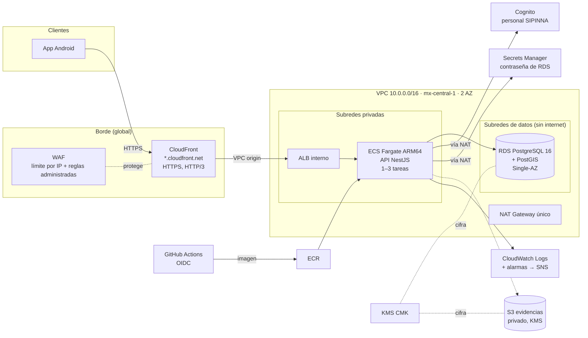

# Arquitectura en AWS

> Estado real al 10-oct-2026. Fuente: `infra/terraform/` y consultas de solo lectura a la cuenta (perfil `rieti`).
> `terraform plan` del 10-oct-2026: **sin diferencias** entre el código y lo desplegado.
> Este documento sustituye al borrador de la Etapa 2, que mencionaba Route 53 y ACM como planeados.

## Diagrama

## Servicios

| Capa | Recursos | Notas |
|---|---|---|
| Borde | CloudFront (certificado por defecto `*.cloudfront.net`, `https-only`, sin caché para el API, política de cabeceras de seguridad administrada) + AWS WAF | WAF: 300 solicitudes por IP cada 5 min; reglas de AWS: reputación de IP, Common, Known Bad Inputs, SQLi. El WAF de CloudFront vive en `us-east-1`. |
| Red | VPC con 2 AZ; subredes públicas (NAT), privadas (ALB y ECS) y de datos (RDS, sin ruta a internet); un NAT; endpoint de S3; VPC Flow Logs | El SG por defecto no tiene reglas. |
| Balanceo | ALB **interno**, sin IP pública | Solo lo alcanza CloudFront por *VPC origin*; SG limitado a la lista de prefijos de CloudFront. Logs de acceso a S3 (90 días). |
| Cómputo | ECS Fargate ARM64 (Graviton), 0.25 vCPU / 512 MB, autoescalado 1–3 tareas por CPU | Sistema de archivos de solo lectura, sin `exec`, circuit breaker con rollback. |
| Imágenes | ECR con tags inmutables y escaneo al subir | Conserva las últimas 15. |
| Datos | RDS PostgreSQL 16 `db.t4g.micro`, gp3 cifrado con CMK, `rds.force_ssl=1`, pgAudit (DDL, roles y escrituras, sin parámetros) | Protección contra borrado; snapshot final. Respaldos de 1 día. |
| Identidad | Cognito: alta solo por administrador, contraseñas ≥12 con complejidad, MFA TOTP **opcional**, grupos `Administrador` y `PersonalSIPINNA`, cliente público sin secreto | Sin dominio de Hosted UI configurado (verificado). |
| Secretos | Secrets Manager: contraseña maestra de RDS generada y rotada por AWS, cifrada con la CMK | La API la relee cada 5 min. |
| Almacenamiento | S3 de evidencias: privado, *Block Public Access*, KMS, versionado | Sin endpoint de subida todavía. |
| Operación | CloudWatch Logs (30 días, KMS), 5 alarmas (5xx del ALB, destinos sanos, CPU de ECS y RDS, almacenamiento de RDS), presupuesto mensual (150 USD) → SNS | Sin suscriptores hasta configurar `alerta_emails` (ver runbook). |
| CI/CD | Rol IAM para GitHub Actions por OIDC, limitado a `main` del repositorio | Sin llaves estáticas en GitHub. |
| Estado de Terraform | Bucket S3 cifrado y versionado con bloqueo nativo | Creado con `infra/bootstrap.sh`. |

## Desviaciones respecto al diseño (Etapa 1/2)

| Diseño | Realidad | Justificación / mitigación |
|---|---|---|
| ≥2 AZ con conmutación automática de la BD (RNF-12) | RDS Single-AZ, un NAT, 1 tarea mínima | D-04 (costo). Terraform permite activar `db_multi_az` y más tareas con una variable. |
| Respaldos diarios con retención de 30 días (RNF-13) | 1 día | D-02 (límite del plan gratuito). Variable `db_backup_dias`. Para cambios de riesgo se toma un snapshot manual (runbook). |
| API Gateway + WAF + CloudFront + Route 53 | CloudFront + WAF + ALB interno; sin Route 53 | D-03. El ALB queda protegido por *VPC origin* (no es alcanzable desde internet), que cumple el papel de la cabecera secreta del plan. |
| TLS 1.3 sin degradación (RNF-16) | Con el certificado `*.cloudfront.net` no se puede fijar la versión mínima de TLS | Requiere dominio propio + ACM. HSTS sí está activo (verificado con `curl -I`). |
| 2FA obligatorio (RNF-18) | MFA opcional; el login de la app no soporta el reto | D-06 (Hosted UI + PKCE) queda en la hoja de ruta. |
| RLS por municipio (RNF-19) | No existe; los reportes aún no guardan municipio | Planeado. El rol `rieti_app` (D-08) está preparado en `infra/sql/`. |
| Bitácora inmutable (RNF-21) | Trigger append-only en `seguimiento` + pgAudit | Implementado. |
| URLs prefirmadas ≤15 min (RNF-22) | Bucket y permisos listos, sin endpoint | Fuera del alcance de esta entrega. |
| Anónimo sin IP (RNF-29) | La BD no guarda IP. El WAF guarda muestras con IP por 3 h; los logs del ALB registran a CloudFront como cliente | Documentado como control parcial. |
| Redshift, QuickSight, OpenSearch, SES, Lambda | No desplegados | Las estadísticas, cuando se hagan, saldrán de PostgreSQL/PostGIS. |
| Docker/Kubernetes | ECS Fargate | Contenedores gestionados equivalentes, sin administrar nodos. |
| Etiqueta `proyecto=rieti` (D-09) | Etiquetas `Project=RIETI`, `Environment`, `ManagedBy=Terraform` | Mismo propósito; se conserva la convención ya desplegada. |

## Costo

El plan del equipo estima ≈90–110 USD/mes (NAT, ALB, RDS, Fargate y WAF son los mayores). **No se verificó contra la facturación.** El presupuesto de AWS avisa al 80 % real y al 100 % pronosticado de 150 USD.

## Datos publicados en el repositorio

El repositorio es público. El nombre del bucket de estado de Terraform contiene el ID de la cuenta de AWS; un ID de cuenta no es un secreto, pero el equipo puede cambiarlo por una variable si prefiere no publicarlo. No hay correos personales, llaves ni archivos de estado en el repositorio (verificado con `gitleaks` y búsqueda en los archivos versionados).
