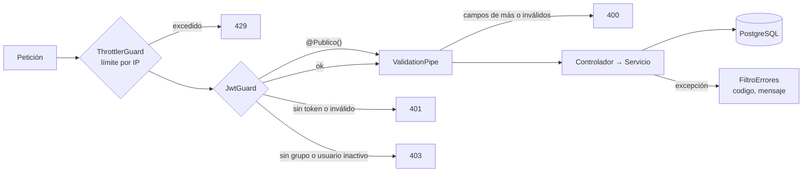

# Arquitectura del backend

> Estado al 10-oct-2026, rama `integracion-final`. Código en `backend/`.

## Plataforma

| Tema | Elección |
|---|---|
| Runtime | Node.js 24 LTS (≥ 24.7, por `crypto.argon2`) |
| Framework | NestJS 11 + Express |
| Datos | PostgreSQL 16 + PostGIS en Amazon RDS, con TypeORM 0.3 (migraciones, sin `synchronize`) |
| Validación | `class-validator` + `class-transformer` |
| Seguridad HTTP | `helmet`, `@nestjs/throttler` |
| Identidad | Amazon Cognito (`@aws-sdk/client-cognito-identity-provider`, `aws-jwt-verify`) |
| Secretos | AWS Secrets Manager (contraseña de RDS rotada por AWS) |
| Pruebas | Jest + ts-jest + Supertest |
| Empaquetado | Docker multietapa `node:24-alpine`, ARM64, usuario no root, `HEALTHCHECK` |

## Módulos

```
src/
├── main.ts                 Arranque
├── configurar-app.ts       Helmet, límite de cuerpo, prefijo /api/v1, ValidationPipe, filtro de errores
├── app.module.ts           TypeORM, throttler, guards globales
├── auth/                   Login con Cognito, guard JWT (deniega por defecto), roles
├── reportes/               Registro, consulta ciudadana, bandeja, estatus, bitácora
│   ├── estatus.ts            Máquina de estados de la Etapa 1
│   ├── clave-consulta.ts     Clave aleatoria + Argon2id
│   └── limitador-intentos.ts Bloqueo por folio
├── avisos/                 Aviso de privacidad vigente
├── catalogos/              Entidades y endpoint de catálogos
├── comun/filtro-errores.ts Formato único {codigo, mensaje, detalle?}
├── health/                 /health y /health/ready
├── config/                 TypeORM y contraseña desde Secrets Manager
├── database/migrations/    Esquema versionado
└── scripts/borrar-reporte.ts  Herramienta de administración (tarea única de ECS)
```

## Rutas

| Método | Ruta | Acceso | Caso de uso |
|---|---|---|---|
| GET | `/health`, `/health/ready` | Público (fuera del prefijo) | Sondas del ALB/ECS |
| GET | `/api/v1/avisos-privacidad/vigente` | Público | CU-02 |
| GET | `/api/v1/catalogos` | Público | Chips del formulario |
| POST | `/api/v1/reportes` | Público, 5/min por IP | CU-04 |
| POST | `/api/v1/reportes/consulta` | Público, 10/min por IP + bloqueo por folio | CU-08 |
| POST | `/api/v1/auth/login` | Público, 5/min por IP | Login del personal |
| GET | `/api/v1/reportes` | Personal | CU-09 bandeja |
| GET | `/api/v1/reportes/:id` | Personal | CU-09 detalle |
| PATCH | `/api/v1/reportes/:id/estatus` | Personal | CU-09/CU-10 |
| POST | `/api/v1/reportes/:id/seguimientos` | Personal | Nota de seguimiento |

Contrato completo: [docs/api/openapi.json](../api/openapi.json). Se retiraron `GET /reportes/folio/:folio` (permitía enumerar reportes) y `PATCH /reportes/:id`.

## Flujo de una petición



## Modelo de datos

Basado en el ER de la Etapa 2. Tablas: `municipio`, `rol_usuario`, `actividad`, `riesgo`, `rango_edad`, `estatus_reporte` (catálogos); `usuario` (personal, vinculado a Cognito por `cognito_sub`, sin contraseñas); `ubicacion` (lat/lng + columna generada `punto geography(Point,4326)` con índice GiST); `reporte`; `folio` + `folio_contador` (consecutivo anual atómico); `caso` y `reporte_caso`; `seguimiento` (bitácora solo de inserción, protegida por trigger).

Migraciones:
1. `1760000000000-EsquemaInicial`: esquema, PostGIS, pgAudit (si está precargado), trigger de la bitácora y catálogos.
2. `1760100000000-ClaveConsultaYEstatus`: `reporte.clave_consulta_hash`, `reporte.aviso_privacidad_version`, `caso.motivo_descarte` y catálogo de estatus canónico (renombra Atendido → En atención y Cerrado → Concluido, agrega Descartado). Al renombrar en vez de borrar, las referencias de la bitácora se conservan.

Las migraciones corren al arrancar (`migrationsRun`). Con un usuario sin permisos de DDL (`rieti_app`, D-08) se desactivan con `DB_MIGRAR_AL_INICIAR=false` y se corren aparte con el usuario maestro.

## Máquina de estados

| Desde | Hacia |
|---|---|
| Recibido | En revisión, Descartado |
| En revisión | En atención, Canalizado, Descartado |
| En atención | Canalizado, Concluido |
| Canalizado | Concluido |
| Concluido | En atención (reincidencia; exige comentario) |
| Descartado | — (terminal; exige motivo) |

`estatus.ts` es la única fuente de verdad. El detalle del reporte incluye `transicionesPermitidas` para que los clientes no dupliquen la regla.

## Configuración (variables de entorno)

| Variable | Uso |
|---|---|
| `PORT` | Puerto HTTP (3000) |
| `DB_HOST`, `DB_PORT`, `DB_NAME`, `DB_USERNAME` | Conexión a PostgreSQL |
| `DB_SECRET_ARN` / `DB_PASSWORD` | Contraseña desde Secrets Manager (AWS) o directa (local) |
| `DB_SSL`, `DB_SSL_CA` | TLS a RDS (`false` solo en local) |
| `DB_MIGRAR_AL_INICIAR` | `false` para no correr migraciones al arrancar |
| `COGNITO_USER_POOL_ID`, `COGNITO_CLIENT_ID` | Validación de JWT y login |
| `TRUST_PROXY_HOPS` | Saltos de proxy (CloudFront → ALB = 2) para obtener la IP del límite de tasa |
| `CORS_ORIGINS` | Orígenes web permitidos (vacío: sin CORS) |

## Pruebas

```bash
cd backend
npm ci && npm run build
npm test                                   # unitarias (45)
E2E_DB_PORT=5432 E2E_DB_PASSWORD=... npm run test:e2e        # e2e contra PostgreSQL + PostGIS
E2E_COMO_RIETI_APP=1 E2E_DB_PORT=5432 ... npm run test:e2e   # e2e conectado como rieti_app
```

Las e2e crean la base `rieti_e2e`, corren las migraciones reales y prueban las rutas con el guard real; solo el verificador de JWT de Cognito se sustituye por un doble (inyectado con el token `VERIFICADOR_JWT`). En CI corren con el contenedor `postgis/postgis:16-3.4` en ambos modos.

## Despliegue

`.github/workflows/backend.yml`: en cada push a `main` que toque `backend/`, corre pruebas unitarias y e2e, construye la imagen ARM64, la sube a ECR (tag = SHA del commit, inmutable), registra una nueva revisión de la task definition y actualiza el servicio ECS (con rollback automático). La autenticación con AWS es por OIDC. Al arrancar, la tarea nueva aplica las migraciones pendientes.
