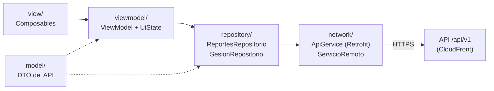
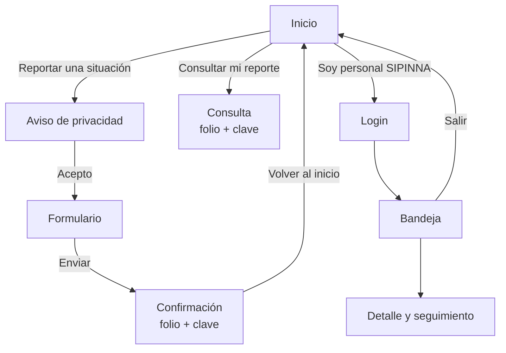

# Arquitectura de la app Android

> Estado al 10-oct-2026, rama `integracion-final`. Código en `app/`.

## Plataforma y librerías

| Tema | Elección |
|---|---|
| Lenguaje | Kotlin 1.9.24 |
| UI | Jetpack Compose (BOM 2024.06.00, compiler extension 1.5.14) + Material 3 |
| Arquitectura | MVVM: `ViewModel` + `StateFlow` + `UiState` sellado |
| Navegación | Navigation Compose (una sola Activity) |
| Red | Retrofit 2.9 + Gson + OkHttp 4.12 (logging solo en debug y sin cuerpos) |
| Ubicación | Google Play Services Location 21.3 (lectura única bajo demanda) |
| Pruebas | JUnit 4 en la JVM |
| Build | AGP 8.13.2, Gradle 8.13, minSdk 26, compile/targetSdk 34, JDK 17 o 21 (no 25) |

No se usan inyección de dependencias (Hilt/Koin) ni Room: los repositorios reciben el `ApiService` por constructor con un valor por defecto, lo que basta para sustituirlo en pruebas.

## Capas



- **view/**: funciones `@Composable` sin lógica de negocio. Leen `StateFlow` con `collectAsState()` y llaman métodos del ViewModel.
- **viewmodel/**: estado de cada pantalla como `UiState` (`Inactivo`, `Cargando`, `Exito`, `Error`). La validación del formulario vive en `ValidadorReporte`, que es lógica pura y tiene pruebas.
- **repository/**: único lugar donde se llama a Retrofit. `ejecutar { }` convierte cualquier excepción en `Resultado.Error(codigo, mensaje)` usando el formato de error del API.
- **network/**: contrato Retrofit (`ApiService`) y cliente HTTP (`ServicioRemoto`), que agrega `Authorization: Bearer` cuando hay sesión.
- **model/**: clases de datos que reflejan el JSON del API ([docs/api/openapi.json](../api/openapi.json)).

## Pantallas y navegación



| Pantalla | Archivo | Qué hace |
|---|---|---|
| Inicio | `InicioScreen.kt` | Reportar (anónimo), consultar o entrar como personal. Recordatorio del 911. Sin "Crear cuenta" (D-12). |
| Aviso de privacidad | `AvisoPrivacidadScreen.kt` | Descarga el aviso vigente del API; exige aceptarlo para continuar. |
| Formulario | `FormularioReporteScreen.kt` | Lugar de los hechos (texto + GPS opcional con aviso de precisión), cantidad, edad, actividad, riesgo y descripción. |
| Confirmación | `ConfirmacionScreen.kt` | Folio y clave, con advertencia de que la clave no se puede recuperar y botón para copiarlos. |
| Consulta | `ConsultaScreen.kt` | Folio + clave → estatus e historial público. |
| Login | `LoginScreen.kt` | Correo y contraseña (oculta) del personal. |
| Bandeja | `BandejaScreen.kt` | Reportes del más reciente al más antiguo, filtro por estatus, cerrar sesión. |
| Detalle | `DetalleReporteScreen.kt` | Datos del reporte, cambio de estatus (solo opciones válidas que manda el servidor), notas y bitácora. |

El grafo vive en `view/MainActivity.kt` y las rutas en `view/Rutas.kt`. Si el servidor responde `NO_AUTENTICADO` en la bandeja o el detalle, la app descarta el token y regresa al login.

## Seguridad en el dispositivo

- **Sin texto claro en release.** `usesCleartextTraffic="false"`; el build debug permite HTTP solo hacia `10.0.2.2` (`src/debug/res/xml/network_security_config.xml`).
- **Token solo en memoria.** No se escribe en disco; al cerrar la app hay que volver a iniciar sesión.
- **Sin respaldos.** `allowBackup="false"` y `data_extraction_rules.xml` excluye todo de la nube y de la transferencia entre dispositivos.
- **`FLAG_SECURE` en release.** Impide capturas de pantalla y la vista previa en "recientes". En debug está desactivado para poder documentar con capturas.
- **Minimización.** La app no envía identificadores del dispositivo. La ubicación del teléfono solo se usa si la persona toca "Estoy en el lugar", y se envía como ubicación del lugar de los hechos.
- **Sin terceros.** Se eliminó la miniatura de mapa de un servicio público, que enviaba las coordenadas del reporte fuera del sistema.

## Configuración

`BuildConfig.API_URL` se define en `app/build.gradle.kts` (por defecto la URL de CloudFront). Para usar un backend local en el emulador:

```bash
./gradlew assembleDebug -Prieti.apiUrl=http://10.0.2.2:3000/
```

## Pruebas y calidad

```bash
./gradlew assembleDebug testDebugUnitTest lintDebug
```

- `ValidadorReporteTest`: reglas del formulario, catálogos y normalización del folio.
- `ErroresApiTest`: traducción de `{codigo, mensaje}`, incluida la diferencia entre "credenciales incorrectas" y "sesión expirada".
- Lint: 0 errores (las 15 advertencias son de versiones de dependencias; no se actualizan sin decisión del equipo).
- CI: `.github/workflows/android.yml`.

## Limitaciones conocidas

- La app no se ha probado en esta rama contra el API desplegado: el API nuevo se despliega al fusionar el PR. El guion de prueba está en [PRUEBA-APP](../PRUEBA-APP.md).
- La bandeja muestra solo la primera página (50 reportes) y el total.
- No hay MFA ni Hosted UI (D-06): el personal usa contraseña permanente.
- No hay modo sin conexión, evidencias fotográficas ni R8.
