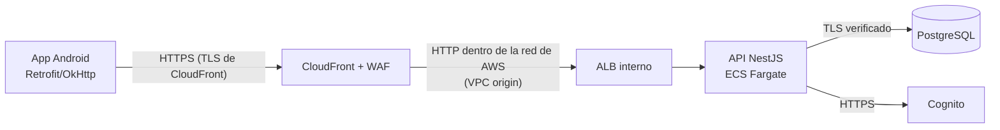
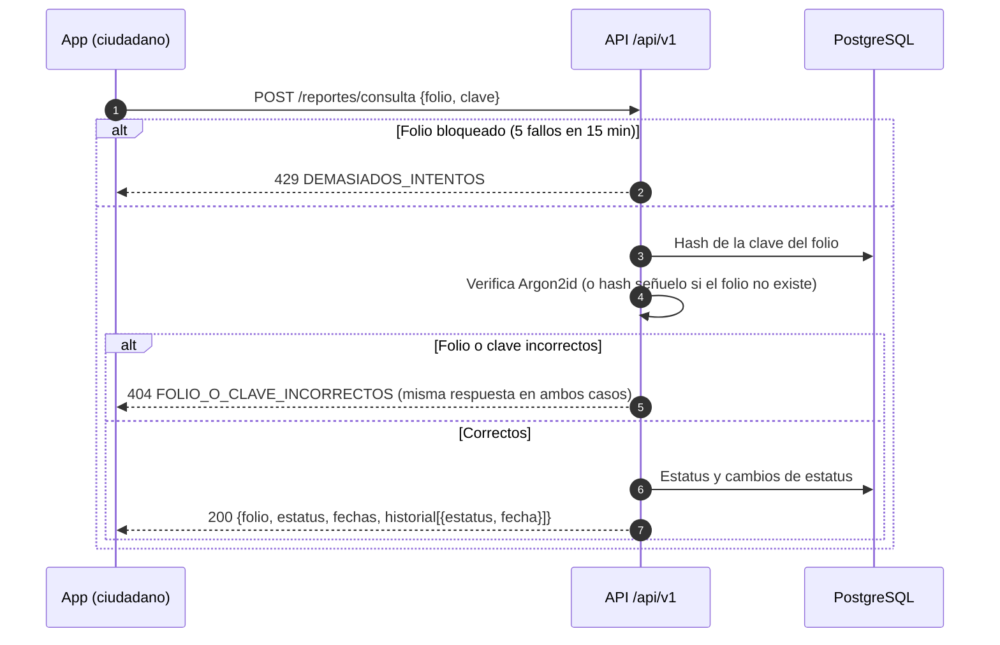
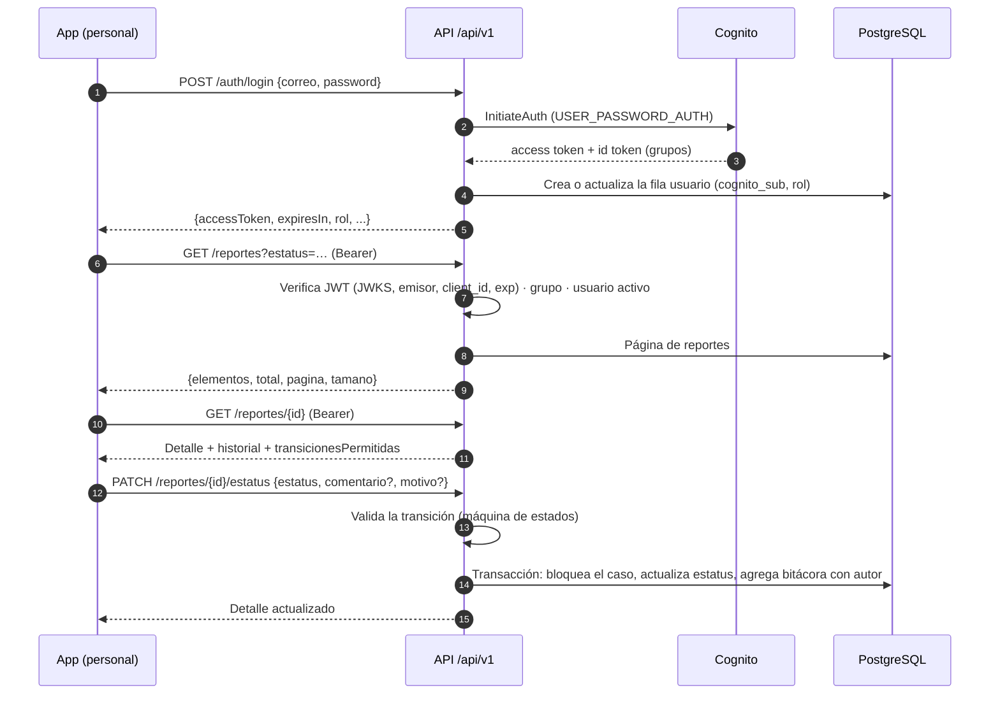

# Interconectividad entre la app y el backend

> Estado al 10-oct-2026, rama `integracion-final`.
> Contrato formal: [docs/api/openapi.json](api/openapi.json) (OpenAPI 3.0).

## Resumen

| Tema | Decisión |
|---|---|
| Estilo | API REST con JSON sobre HTTPS |
| URL base | `https://d3hexe1fo0mq6l.cloudfront.net/` (CloudFront → ALB interno → ECS) |
| Versionado | Prefijo `/api/v1` (RNF-06). `/health` queda fuera del prefijo porque lo usan el ALB, ECS y el CI. |
| Autenticación del personal | `POST /api/v1/auth/login` → access token de Cognito → `Authorization: Bearer <token>` |
| Ciudadano | Sin cuenta: folio + clave de consulta |
| Errores | Siempre `{ "codigo": "...", "mensaje": "...", "detalle"?: [...] }` |
| Cliente Android | Retrofit + Gson (`network/ApiService.kt`), timeouts de 15 s (conexión) y 20 s (lectura) |
| CORS | No aplica a la app. El API solo habilita CORS si se define `CORS_ORIGINS` (para la web futura). |

## Componentes y red



## Flujo 1 — Reporte anónimo (CU-02, CU-04)

```mermaid
sequenceDiagram
    autonumber
    participant C as App (ciudadano)
    participant API as API /api/v1
    participant DB as PostgreSQL
    C->>API: GET /avisos-privacidad/vigente
    API-->>C: {version, parrafos}
    C->>C: Acepta el aviso; llena el formulario (GPS opcional)
    C->>API: POST /reportes {ubicacion, lat?, lng?, cantidadNinos, edadAproximada,<br/>actividad, situacionRiesgo, descripcion, avisoPrivacidadVersion}
    API->>API: Límite 5/min por IP · validación (sin campos extra)
    API->>API: Genera clave aleatoria y su hash Argon2id
    API->>DB: Transacción: ubicación, reporte, folio, caso, bitácora "Recibido"
    API-->>C: 201 {folio, claveConsulta, estatus, fechaCreacion}
    C->>C: Muestra folio y clave una sola vez (no se guardan)
```

## Flujo 2 — Consulta ciudadana (CU-08)



La consulta va por POST para que la clave no quede en la URL ni en logs. La respuesta nunca incluye la descripción, la ubicación ni las notas del personal.

## Flujo 3 — Personal: login, bandeja y seguimiento (CU-09, CU-10)



## Manejo de errores en la app

`repository/Resultado.kt` traduce cada respuesta a `Resultado.Exito` o `Resultado.Error(codigo, mensaje)`:

| Situación | Código | Qué hace la app |
|---|---|---|
| Sin red o tiempo agotado | `SIN_CONEXION` | Mensaje "No hay conexión…" y botón de reintentar |
| Datos inválidos | `SOLICITUD_INVALIDA`, `VALOR_NO_VALIDO` | Muestra el mensaje del servidor |
| Folio o clave incorrectos | `FOLIO_O_CLAVE_INCORRECTOS` | Muestra el mensaje |
| Demasiados intentos | `DEMASIADOS_INTENTOS` | Muestra el mensaje (esperar) |
| Token vencido o inválido | `NO_AUTENTICADO` | Descarta el token y regresa al login |
| Contraseña incorrecta | `CREDENCIALES_INVALIDAS` | Muestra el mensaje (no se confunde con sesión expirada) |
| Cuenta sin rol o desactivada | `SIN_ROL`, `USUARIO_INACTIVO` | Muestra el mensaje |
| Transición no válida | `TRANSICION_INVALIDA`, `MOTIVO_REQUERIDO`, `COMENTARIO_REQUERIDO` | Muestra el mensaje |

## Compatibilidad

Este contrato reemplaza al anterior (`/reportes`, `/reportes/folio/:folio`, `PATCH /reportes/:id` sin prefijo). Las APK compiladas antes de esta rama **dejan de funcionar** cuando se despliega el backend nuevo; hay que instalar la APK de esta rama.
